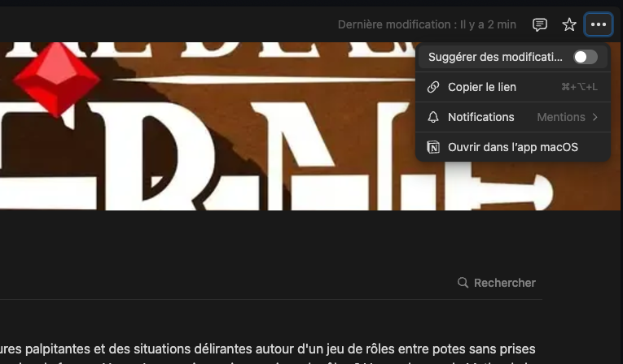

# Principes essentiels

- **Respectez l’agencement des pages** ainsi que le formatage et le style
- **Vérifiez vos sources** et citez-les dés que possible (numéro d’épisode et à quel moment de l’épisode)
- *Exemple : S02EP3 à 1h24.*
- Numéro d’épisode concerné et si possible le timecode (heure / minute)
- Si vous avez des questions dirigez vous vers @Alice Améthyste ou @Toma $

# Comment commencer à suggérer des modifications

> [!note]
> Pour commencer, contactez `Le Tomo` sur Discord pour obtenir un accès au wiki.

## 1. Se rendre sur l’espace du Wiki via votre Notion

> [!note]
> ℹ️
> 
> En premier lieu connectez vous avec l’email transmise à @Toma .

### Utilisez le sélectionneur d’espace de travail

Sélectionner l’espace Notion `Tomo & Friends` via le menu en haut à gauche.

### Ou via le lien

 [[wiki-le-mythe-de-la-taverne]] 

## 2. Si vous n’êtes pas encore éditeurices, activez le mode modifications

Via le menu en haut à droite cochez l’option `Suggérer des modifications`.

Vous pouvez maintenant saisir du texte dans les pages de votre choix !
