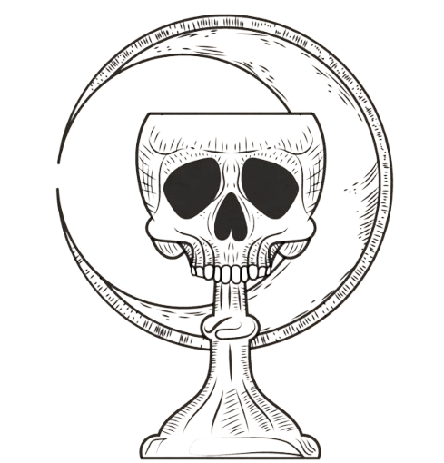

---
---

# Histoire

1. **Chronologie	du monde :**

**Introduction au cours de l’Archimage Léonard Montgomery :**

La première période débute par l’âge des Dieux Aïeuls, qui s’étend de l’éternité jusqu’à la création du monde où les Dieux Aïeuls décident de quitter notre monde. C’est durant cette période que sont créés tous les artéfacts magiques ainsi que l’espace et le temps. Cet âge est suivi par l’âge des mages séculaires, qui voit l’apparition des premières pratiques magiques et la découverte du Plénimythe.

La seconde période débute par l’âge des luttes de pouvoir, âge lequel se passe la guerre pour le contrôle du Plénimythe. C’est durant l’une de ces luttes que le mage Arthur Viféclair est
assassiné. Cet âge est suivi par l’âge de la prospérité magique, où est créé le Collège des Mages, le Chapitre du Bureau Abscons et la Bibliothèque de l’Invisible.

La troisième période débute par les évènements tragiques il y a 30 ans. C’est durant ce cours laps de temps de 10 ans que la pratique de la magie de Esprits est interdite, que l’Archimage Callum est
arrêté, que les Gardiens de l’Art sont créés et où la bataille du Monastère du Cole Vert a eu lieu. Enfin, la période actuelle débuté il y a 15 ans. Marqué par les grandes réformes sur la pratique de l’Art, cette période semble troublée par la résurrection de Neptune d’Aïra et l’évasion de Callum.

1. **La	confession du Songe Brisé :**

La confession du Songe Brisé est une branche obscure des mages de l’esprit qui aurait été chassé et supposément détruite par les Gardiens de l’Art. Leur symbole est un calice marqué d’un crâne sur fond d’une lune.

1. **L’Ordre	des Innocents :**

**Histoire du Collège à travers les âges par le mage Pamélien Briseglace :**

L’Ordre de Innocents est une milice sous les ordres du collège des Mages. En son sein, les Innocents sont chargés d’enquêter sur les pratiques magiques jugées illégales ou dangereuses. Cette milice a été formée après la dissolution des Gardiens de l’Art à la suite des évènements tragiques et remplie, à quelques détails près, les mêmes fonctions.

Ses membres, appelés les Innocents, portent une longue toge rouge sombre et sont armés d’arbalètes spécialement étudiées pour incapaciter les mages récalcitrants qu’ils pourraient rencontrer. Ils sont parfois envoyés à travers le royaume de Veloria pour représenter l’autorité du Collège des Mages dans les contrées éloignées.

En ces temps de paix, l’Ordre des Innocents est rarement sollicité. Ses membres servent essentiellement d’élément dissuasif pour rappeler à l’ordre les mages un peu trop excentriques et veiller au respect des règles. Lélias Morton dirige actuellement les Innocents. Ceux qui le côtoient le décrivent comme un homme intelligent et acharné dans son travail, entièrement dévoué au
Collège des Mages.
